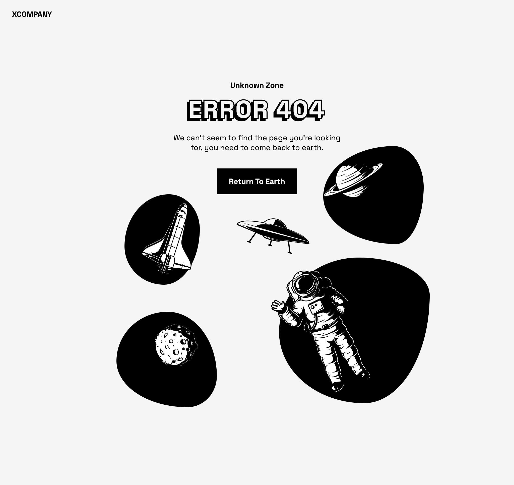

# Custom 404 Error Page

A responsive and interactive 404 error page built with **HTML**, **CSS**, and **JavaScript**, featuring smooth animations using the **GSAP** JavaScript library.

## Preview



## Features

- **Responsive Design**: Optimized for various screen sizes.
- **Interactive Elements**: Engaging and dynamic user experience with JavaScript.
- **GSAP Animations**: Smooth transitions and animations using GSAP library.
- **Custom Styling**: Unique and creative layout with custom CSS.

## Technologies Used

- **HTML5**: Markup for the structure.
- **CSS3**: Styling and layout design.
- **JavaScript**: Interactive functionality and animations.
- **GSAP**: GreenSock Animation Platform for animations.

## Installation

1. Clone the repository:
    ```bash
    git clone https://github.com/your-username/404-error-page.git
    ```

2. Navigate to the project directory:
    ```bash
    cd 404-error-page
    ```

3. Open the `index.html` file in your browser to view the page.

## Usage

This custom 404 error page can be integrated into any web project to enhance user experience when encountering non-existent routes.

## Contributions

Contributions, issues, and feature requests are welcome! Feel free to check the [issues page](https://github.com/Luk30lende/404-error-page/issues).

## License

This project is licensed under the MIT License - see the [LICENSE](LICENSE) file for details.

---

### Author

Designed and developed by [Luke Olende](https://github.com/Luk30lende). Feel free to follow me on GitHub for more projects!
